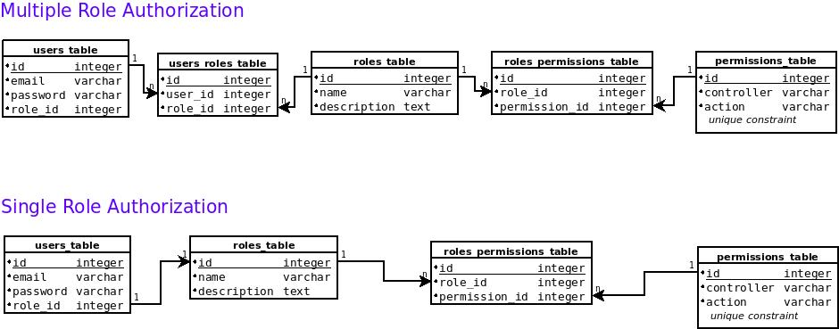

# Api Authorization (The gem is in development)
A multiple role-based authorization, based on controller actions.
`api_authorization` gem acts as a middleware and checks if `current_user` has the right to visit the controller actions.
It does it by checking the roles of `current_user`  if it has any realationships with permissions table.

This work has been inspired by a very similar implementation I've worked on with [Lorenzo Pagano](https://github.com/lorenzopagano) and [Andrea Pavoni](https://github.com/andreapavoni). They taught me the Ruby art and I'll be forever grateful for this.


[](https://opensource.org/licenses/MIT)

##### Database Model

## Installation
Add this line to your application's Gemfile:

```ruby
gem 'api_authorization'
```

And then execute:
```bash
$ bundle
```

Or install it yourself as:
```bash
$ gem install api_authorization
```

## Usage
1. After you have created your users_table(through devise or manually) next run 
```bash
$ rails api_auth:install
```
2. Next populate permissions table with your controllers and actions run:
```bash
$ rails api_auth:re_populate_permissions
```
3. Include the Authorization module on your `ApplicationController` :
```ruby
  include ActionController::Helpers
  include ApiAuthorization
  enable_role_authorization
```
#### Make sure that `current_user` is not `nil` before putting the snippet above.

4. You can create/read/update/delete roles and permissions for the user through [CLI commands](cli.MD) or by
using the dashboard which is depended on [rails_admin](https://github.com/sferik/rails_admin) gem you need to install seperately by running:
```bash
rails api_auth:install_dashboard
```
5. add rails_admin on your Gemfile: 
```ruby
  gem 'rails_admin', '~> 2.0'
```
6. And after running `bundle instal` and starting the rails app visit:
```
http://localhost:3000/auth_dashboard
```
#
### [CLI commands](cli.MD)

### Managing Roles and Permissions
There are two ways to manage your roles and
## Contributing
Feel free to suggest a feature or report a bug.
#### [Code Of Conduct](CODE_OF_CONDUCT.md)

## License
The gem is available as open source under the terms of the [MIT License](https://opensource.org/licenses/MIT).
